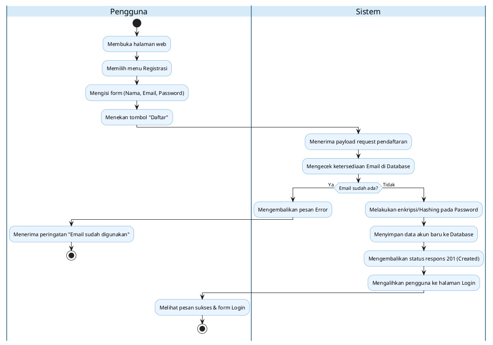
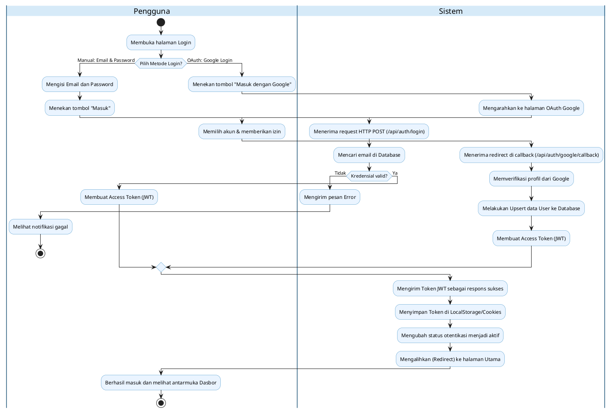
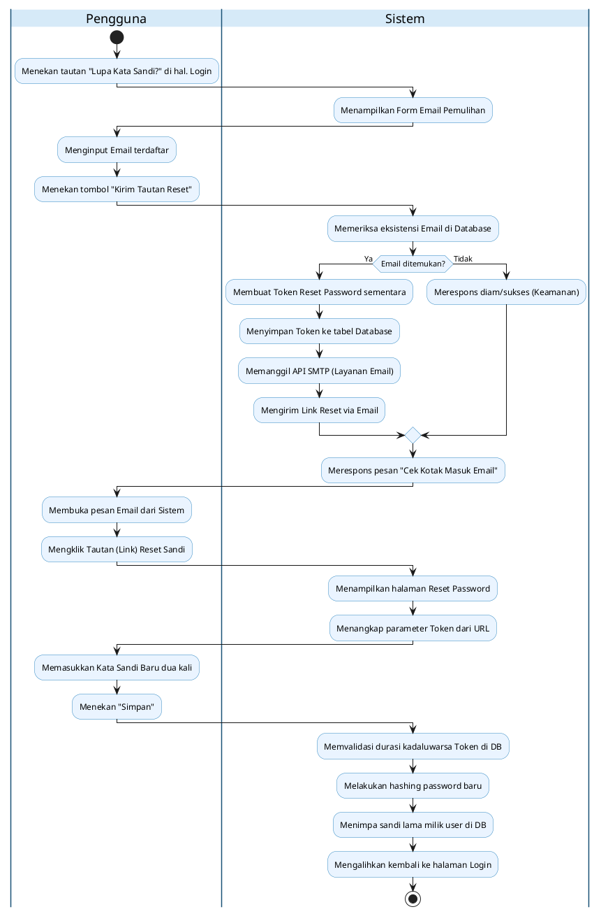
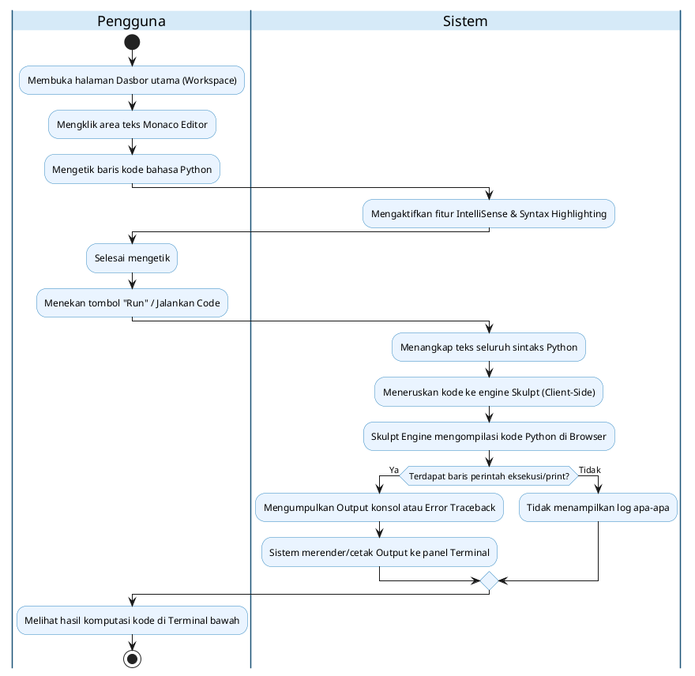
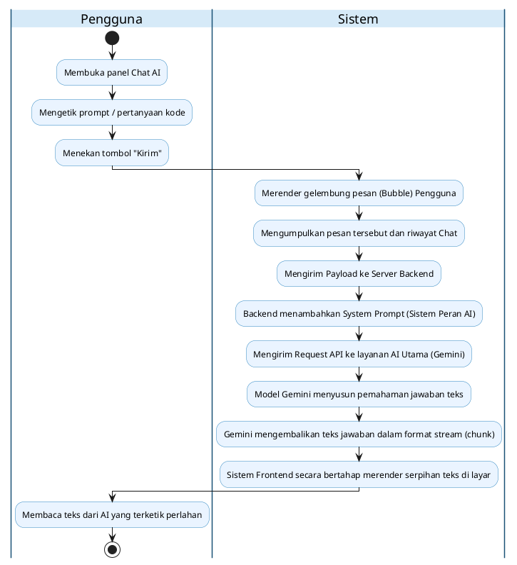
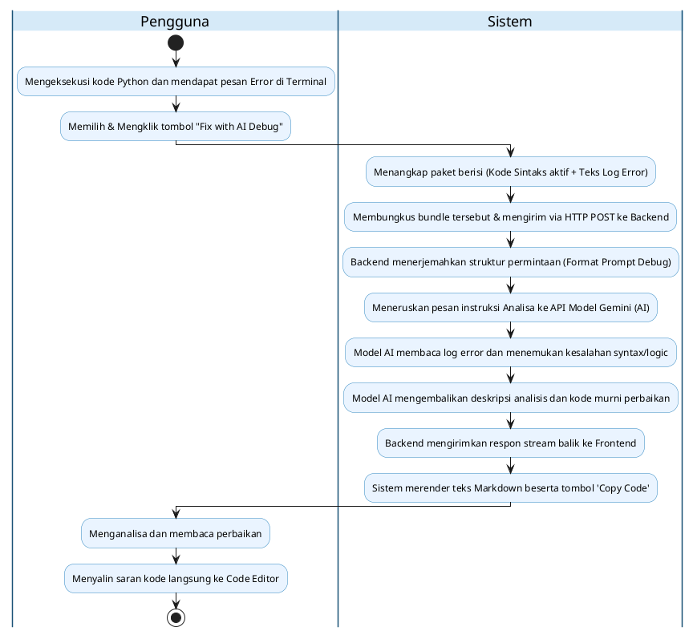
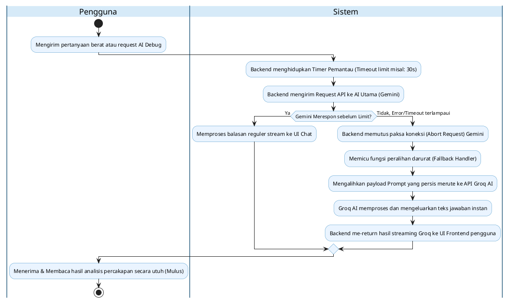
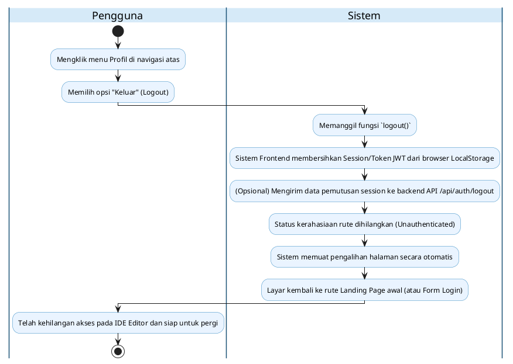
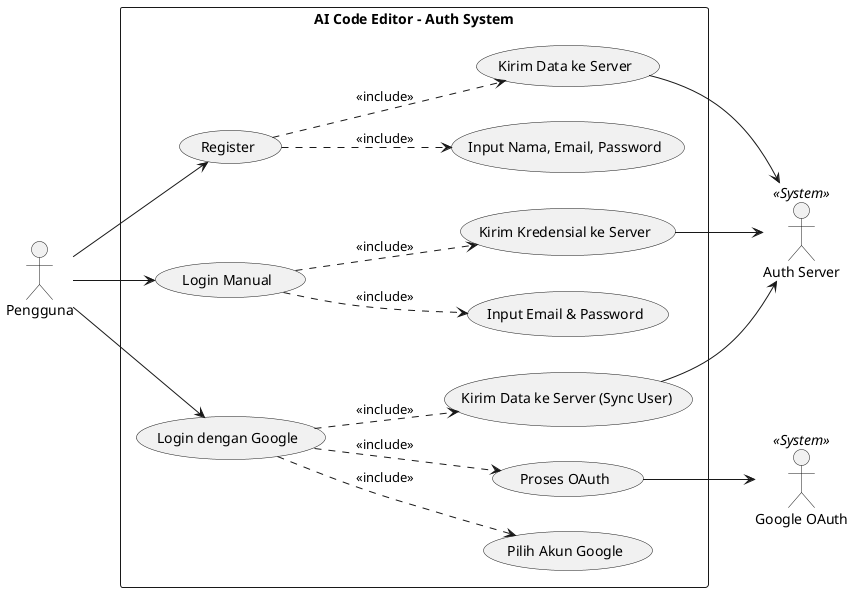

# Activity Diagram per Fitur (Swimlane: Pengguna & Sistem)

Dokumen ini berisi sekumpulan kode PlantUML untuk membuat Activity Diagram pada masing-masing fitur aplikasi AI Code Editor. Diagram ini menggunakan partisi (swimlane) berkolom antara **"Pengguna"** (Panel User) dan **"Sistem"** (Sistem UI/Frontend, Backend, dan Layanan Eksternal/AI) agar rapi dan sesuai standar penulisan skripsi.

---

## 1. Registrasi Akun (Register)

---

## 2. Masuk Sistem (Login)

---

## 3. Lupa Kata Sandi (Forgot Password)

---

## 4. Code Editor (Menulis & Eksekusi Python)

---

## 5. AI Chat (Percakapan Asisten AI)

---

## 6. AI Debug (Debugging Error Otomatis)

---

## 7. AI Fallback (Failover Cadangan)

---

## 8. Keluar Sistem (Logout)

---

## 9. Use Case Diagram: Autentikasi (Register & Login)

